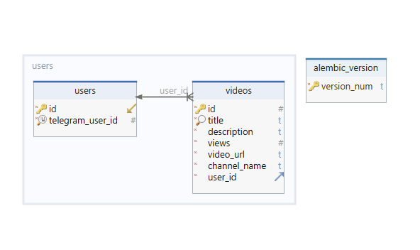

# Проект "Parsing bot"

Реализация асинхронного телеграм бота на базе `aiogram 3`, предоставляющий парсеринг видео с видеохостинга `Rutube`.

### Требования

1. Пользователь может вставлять ссылку на канал с видеохостинга Видеохостинг RUTUBE.
2. Указать количество видео для парснга и получить ответ от бота в виде:
- Наименование видео
- Краткое описание до 100 символов
- Количество просмотров
- Ссылка на видео
3. Видео, которые пользователь запрашивал ранее должны быть сохранены в БД.
4. У пользователя должна быть возможность просмотра ранее сохраненных видео.

 

## Технологический стек:
- [Python 3.11.5](https://docs.python.org/release/3.11.5/)
- [Aiogram 3.6.0](https://docs.aiogram.dev/en/latest/)
- [SqlAlchemy 2.0.30](https://www.sqlalchemy.org/)
- [Httpx 0.27.0](https://www.python-httpx.org/)
- [Beautifulsoup4 4.12.3](https://www.crummy.com/software/BeautifulSoup/bs4/doc/)
- [PostgreSQL](https://www.postgresql.org/docs/current/)
- [Asyncpg 0.29.0](https://magicstack.github.io/asyncpg/current/)
- [Alembic 1.13.1](https://alembic.sqlalchemy.org/en/latest/)
- [Python dotenv 1.0.1](https://pypi.org/project/python-dotenv/)

 

## Запуск проекта :shipit: :
[Руководство по созданию переменных окружения](.env.example)

[Руководство по развёртыванию проекта локально](./SetUpLocal.md)

 

## Схема базы данных:

 

## Dreamteam:

[GitHub](https://github.com/Furturnax) | Разработчик - Andrew Fedorchenko 